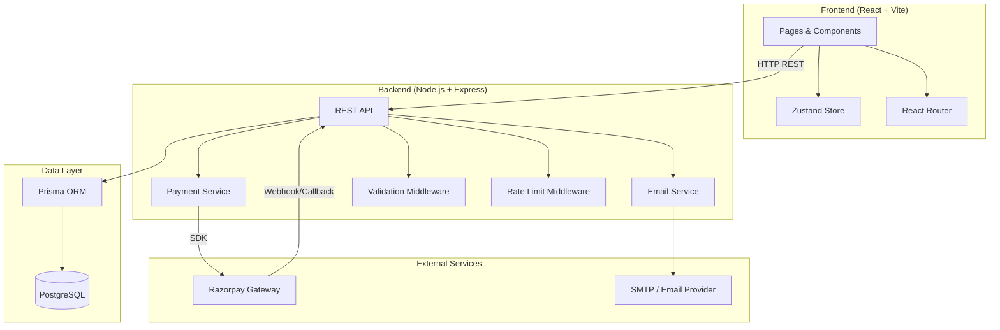
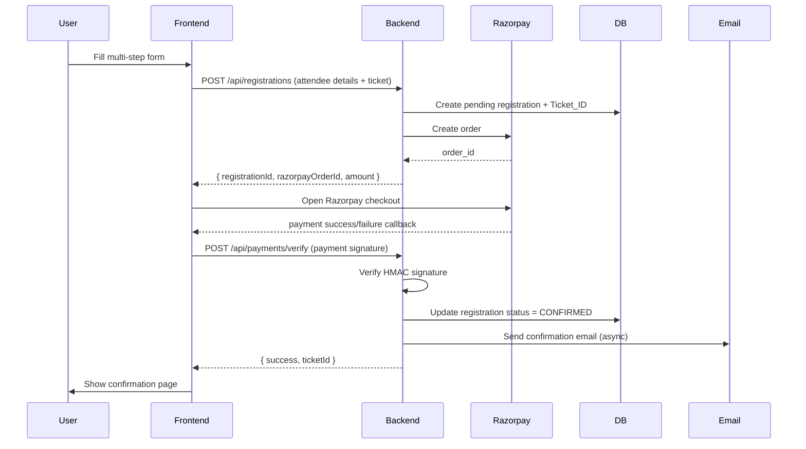
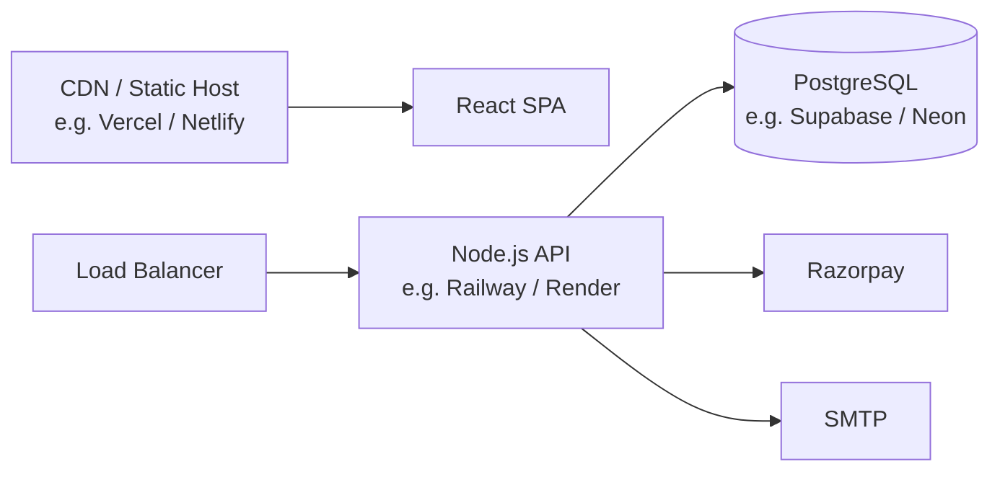

# Design Document: AllHealthTech Event Platform

## Overview

The AllHealthTech Event Platform is a full-stack single-event registration website for health technology conferences. It provides a modern, conversion-optimized experience for attendees to discover the event, register, pay, and manage their tickets — all without requiring user authentication.

The system is composed of:
- A **React (Vite)** SPA frontend with Tailwind CSS, Framer Motion animations, and Zustand state management
- A **Node.js + Express** REST API backend
- A **PostgreSQL** database accessed via Prisma ORM
- **Razorpay** for payment processing
- An **email service** (Nodemailer or similar) for transactional emails

The design prioritizes:
- High conversion through a smooth multi-step registration flow
- Trust signals (secure payment badges, professional design, clear policies)
- Operational simplicity (no auth system, lookup by email + Ticket_ID)
- Correctness of payment and registration state transitions

---

## Architecture

### High-Level Architecture



### Request Flow: Registration + Payment



### Deployment Architecture



---

## Components and Interfaces

### Frontend Pages

| Page | Route | Description |
|------|-------|-------------|
| Home | `/` | Hero, stats, highlights, speakers preview, agenda preview, sponsors |
| About Event | `/about` | Full event description, venue, organizers |
| Agenda | `/agenda` | Full schedule with filtering by track |
| Speakers | `/speakers` | Speaker grid with expandable profiles |
| Pricing | `/pricing` | Ticket tiers comparison table |
| Registration | `/register` | Multi-step registration flow |
| Contact | `/contact` | Contact info + contact form |
| Check Registration | `/check-registration` | Lookup by email + Ticket_ID |
| Policies | `/policies` | Privacy, Terms, Refund policies |

### Frontend Component Tree

```
App
├── Layout
│   ├── Navbar (with mobile hamburger)
│   └── Footer (with policy links)
├── Pages
│   ├── HomePage
│   │   ├── HeroSection
│   │   ├── StatsCounter (animated)
│   │   ├── HighlightsSection
│   │   ├── FeaturedSpeakers
│   │   ├── AgendaPreview
│   │   └── SponsorsSection
│   ├── AgendaPage
│   │   ├── AgendaFilter
│   │   └── AgendaItem[]
│   ├── SpeakersPage
│   │   ├── SpeakerCard[]
│   │   └── SpeakerModal
│   ├── PricingPage
│   │   └── TicketCard[]
│   ├── RegistrationPage
│   │   ├── StepIndicator
│   │   ├── TicketSelectionStep
│   │   ├── AttendeeDetailsStep
│   │   ├── ReviewStep
│   │   ├── PaymentStep
│   │   └── SuccessStep
│   ├── CheckRegistrationPage
│   │   ├── LookupForm
│   │   └── RegistrationDetails
│   ├── ContactPage
│   │   └── ContactForm
│   └── PoliciesPage
└── Shared
    ├── Button
    ├── Input
    ├── Card
    ├── Badge
    ├── LoadingSpinner
    └── ErrorMessage
```

### Zustand Store Structure

```typescript
interface RegistrationStore {
  // Step management
  currentStep: 'ticket' | 'details' | 'review' | 'payment' | 'success';
  setStep: (step: Step) => void;

  // Ticket selection
  selectedTicket: TicketType | null;
  setSelectedTicket: (ticket: TicketType) => void;

  // Attendee details
  attendeeDetails: AttendeeDetails | null;
  setAttendeeDetails: (details: AttendeeDetails) => void;

  // Registration result (post-payment)
  confirmedTicketId: string | null;
  setConfirmedTicketId: (id: string) => void;

  // Clear sensitive data after payment
  clearPaymentData: () => void;

  // Reset entire flow
  reset: () => void;
}

interface UIStore {
  mobileMenuOpen: boolean;
  toggleMobileMenu: () => void;
}
```

### Backend API Modules

```
src/
├── routes/
│   ├── registrations.ts   POST /api/registrations, GET /api/registrations/lookup
│   ├── payments.ts        POST /api/payments/initiate, POST /api/payments/verify
│   ├── cancellations.ts   POST /api/registrations/:id/cancel
│   ├── events.ts          GET /api/events/current
│   ├── speakers.ts        GET /api/speakers
│   ├── agenda.ts          GET /api/agenda
│   └── contact.ts         POST /api/contact
├── services/
│   ├── paymentService.ts  Razorpay order creation + signature verification
│   ├── emailService.ts    Confirmation + cancellation emails
│   └── ticketService.ts   Ticket_ID generation
├── middleware/
│   ├── validate.ts        Zod schema validation
│   ├── rateLimit.ts       express-rate-limit configuration
│   └── errorHandler.ts    Global error handler
└── prisma/
    ├── schema.prisma
    └── seed.ts
```

### API Endpoints

| Method | Path | Description | Auth |
|--------|------|-------------|------|
| GET | `/api/events/current` | Get current event info | None |
| GET | `/api/speakers` | List all speakers | None |
| GET | `/api/agenda` | List agenda items | None |
| POST | `/api/registrations` | Create pending registration | None |
| GET | `/api/registrations/lookup` | Lookup by email + ticketId | None |
| POST | `/api/payments/initiate` | Create Razorpay order | None |
| POST | `/api/payments/verify` | Verify payment + confirm registration | None |
| POST | `/api/registrations/:id/cancel` | Cancel registration + initiate refund | None |
| POST | `/api/contact` | Submit contact form | None |

---

## Data Models

### Prisma Schema

```prisma
model Event {
  id          String   @id @default(cuid())
  name        String
  date        DateTime
  endDate     DateTime?
  location    String
  venue       String?
  description String
  bannerUrl   String?
  createdAt   DateTime @default(now())
  updatedAt   DateTime @updatedAt

  ticketTypes TicketType[]
  registrations Registration[]
  agendaItems AgendaItem[]
  speakers    Speaker[]
}

model TicketType {
  id          String   @id @default(cuid())
  eventId     String
  name        String   // e.g. "General", "VIP", "Student"
  price       Int      // in paise (smallest currency unit)
  currency    String   @default("INR")
  description String
  features    String[] // list of included features
  capacity    Int?     // null = unlimited
  soldCount   Int      @default(0)
  isActive    Boolean  @default(true)
  createdAt   DateTime @default(now())

  event         Event          @relation(fields: [eventId], references: [id])
  registrations Registration[]
}

model Registration {
  id                  String             @id @default(cuid())
  ticketId            String             @unique  // human-readable e.g. AHT-2025-00042
  eventId             String
  ticketTypeId        String
  
  // Attendee details
  attendeeName        String
  attendeeEmail       String
  attendeePhone       String
  organization        String?
  role                String?
  
  // Payment
  paymentStatus       PaymentStatus      @default(PENDING)
  paymentTransactionId String?
  razorpayOrderId     String?
  razorpayPaymentId   String?
  razorpaySignature   String?
  amountPaid          Int?               // in paise
  
  // Status
  status              RegistrationStatus @default(PENDING)
  cancelledAt         DateTime?
  refundId            String?
  refundStatus        RefundStatus?
  
  createdAt           DateTime           @default(now())
  updatedAt           DateTime           @updatedAt

  event       Event       @relation(fields: [eventId], references: [id])
  ticketType  TicketType  @relation(fields: [ticketTypeId], references: [id])

  @@index([attendeeEmail])
  @@index([ticketId])
  @@index([attendeeEmail, ticketId])
}

model Speaker {
  id           String   @id @default(cuid())
  eventId      String
  name         String
  title        String
  organization String
  biography    String
  photoUrl     String?
  linkedinUrl  String?
  twitterUrl   String?
  isFeatured   Boolean  @default(false)
  displayOrder Int      @default(0)
  createdAt    DateTime @default(now())

  event       Event        @relation(fields: [eventId], references: [id])
  agendaItems AgendaItem[]
}

model AgendaItem {
  id          String   @id @default(cuid())
  eventId     String
  title       String
  description String?
  startTime   DateTime
  endTime     DateTime
  track       String?
  location    String?
  speakerId   String?
  displayOrder Int     @default(0)
  createdAt   DateTime @default(now())

  event   Event    @relation(fields: [eventId], references: [id])
  speaker Speaker? @relation(fields: [speakerId], references: [id])

  @@index([eventId, startTime])
}

enum PaymentStatus {
  PENDING
  PAID
  FAILED
  REFUNDED
  PARTIALLY_REFUNDED
}

enum RegistrationStatus {
  PENDING
  CONFIRMED
  CANCELLED
}

enum RefundStatus {
  INITIATED
  PROCESSED
  FAILED
}
```

### Ticket_ID Generation

Ticket IDs follow the format `AHT-YYYY-NNNNN` (e.g., `AHT-2025-00042`):
- `AHT` — event prefix
- `YYYY` — registration year
- `NNNNN` — zero-padded sequential number

Generated server-side using a database sequence or atomic counter to guarantee uniqueness.

### API Request/Response Shapes

```typescript
// POST /api/registrations
interface CreateRegistrationRequest {
  ticketTypeId: string;
  attendeeName: string;
  attendeeEmail: string;
  attendeePhone: string;
  organization?: string;
  role?: string;
}

interface CreateRegistrationResponse {
  registrationId: string;
  ticketId: string;
  razorpayOrderId: string;
  amount: number;       // in paise
  currency: string;
  keyId: string;        // Razorpay public key for checkout
}

// POST /api/payments/verify
interface VerifyPaymentRequest {
  registrationId: string;
  razorpayOrderId: string;
  razorpayPaymentId: string;
  razorpaySignature: string;
}

interface VerifyPaymentResponse {
  success: boolean;
  ticketId: string;
  message: string;
}

// GET /api/registrations/lookup?email=&ticketId=
interface LookupResponse {
  ticketId: string;
  attendeeName: string;
  attendeeEmail: string;
  ticketType: string;
  paymentStatus: string;
  registrationStatus: string;
  eventName: string;
  eventDate: string;
  eventLocation: string;
  createdAt: string;
}

// POST /api/registrations/:id/cancel
interface CancelRegistrationRequest {
  email: string;        // ownership verification
  ticketId: string;
}

interface CancelRegistrationResponse {
  success: boolean;
  refundId: string;
  message: string;
}
```

---

## Correctness Properties

