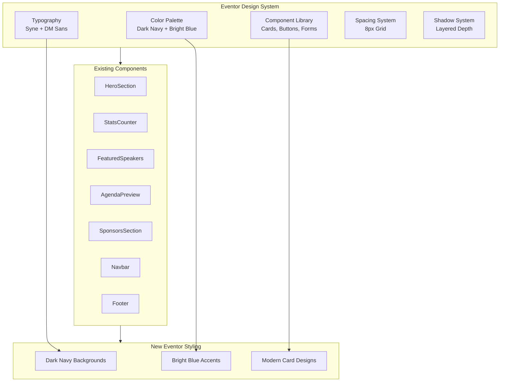
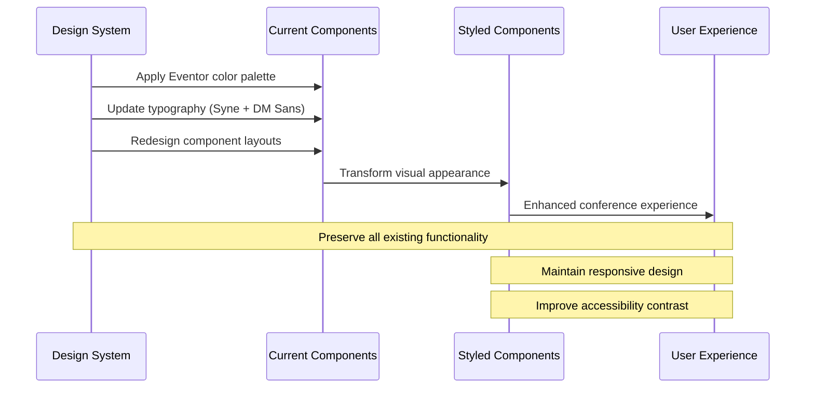
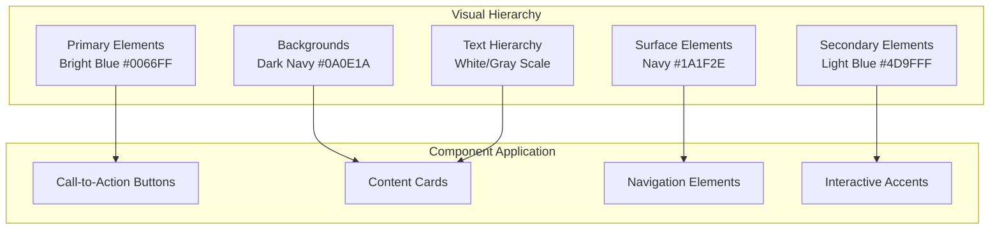

# Design Document: Eventor UI Redesign

## Overview

The Eventor UI Redesign transforms the existing AllHealthTech conference landing page to match the Eventor design language while preserving all existing content and functionality. This comprehensive visual redesign introduces a sophisticated dark navy color system with bright blue accents, modern typography using Syne and DM Sans fonts, and refined component styling that creates a premium, professional conference experience.

The redesign maintains the current React component architecture and functionality while completely overhauling the visual presentation. All existing sections (navigation, hero, stats, about, speakers, schedule, pricing, venue, sponsors, testimonials, FAQ, newsletter, footer) will be rebuilt with new styling that follows the Eventor design specifications, creating a cohesive and modern conference platform that enhances user engagement and conversion.

The transformation focuses on creating a sophisticated, trustworthy brand presence that appeals to health technology professionals while maintaining excellent accessibility and responsive design across all devices.

## Architecture

### Design System Architecture



### Component Transformation Flow



### Visual Hierarchy System



## Components and Interfaces

### Color System

#### Primary Color Palette

```css
/* Eventor Primary Colors */
--eventor-primary: #0066FF;        /* Bright Blue - Primary CTAs */
--eventor-primary-hover: #0052CC;  /* Darker Blue - Hover States */
--eventor-primary-light: #4D9FFF;  /* Light Blue - Secondary Elements */
--eventor-primary-pale: #E6F2FF;   /* Pale Blue - Light Backgrounds */

/* Eventor Dark System */
--eventor-dark-900: #0A0E1A;       /* Darkest Navy - Main Background */
--eventor-dark-800: #1A1F2E;       /* Dark Navy - Card Backgrounds */
--eventor-dark-700: #2A2F3E;       /* Medium Navy - Borders */
--eventor-dark-600: #3A3F4E;       /* Light Navy - Subtle Elements */

/* Eventor Neutral System */
--eventor-white: #FFFFFF;          /* Pure White - Primary Text */
--eventor-gray-100: #F8F9FA;       /* Light Gray - Secondary Text */
--eventor-gray-300: #E9ECEF;       /* Medium Gray - Borders */
--eventor-gray-500: #6C757D;       /* Dark Gray - Muted Text */
--eventor-gray-700: #495057;       /* Darker Gray - Subtle Text */

/* Eventor Accent Colors */
--eventor-success: #28A745;        /* Green - Success States */
--eventor-warning: #FFC107;        /* Yellow - Warning States */
--eventor-error: #DC3545;          /* Red - Error States */
```

#### Color Usage Guidelines

| Element Type | Primary Color | Secondary Color | Background | Text |
|--------------|---------------|-----------------|------------|------|
| Hero Section | `--eventor-primary` | `--eventor-primary-light` | `--eventor-dark-900` | `--eventor-white` |
| Navigation | `--eventor-primary` | `--eventor-dark-700` | `--eventor-dark-800` | `--eventor-white` |
| Content Cards | `--eventor-primary-light` | `--eventor-gray-300` | `--eventor-dark-800` | `--eventor-white` |
| Buttons (Primary) | `--eventor-white` | `--eventor-primary-hover` | `--eventor-primary` | `--eventor-white` |
| Buttons (Secondary) | `--eventor-primary` | `--eventor-primary-light` | `transparent` | `--eventor-primary` |

### Typography System

#### Font Families

```css
/* Eventor Typography */
--font-primary: 'Syne', system-ui, sans-serif;     /* Headings & Display */
--font-secondary: 'DM Sans', system-ui, sans-serif; /* Body & Interface */
--font-mono: 'JetBrains Mono', monospace;          /* Code & Technical */
```

#### Typography Scale

```css
/* Eventor Type Scale */
--text-xs: 0.75rem;      /* 12px - Small labels */
--text-sm: 0.875rem;     /* 14px - Body small */
--text-base: 1rem;       /* 16px - Body text */
--text-lg: 1.125rem;     /* 18px - Large body */
--text-xl: 1.25rem;      /* 20px - Small headings */
--text-2xl: 1.5rem;      /* 24px - Medium headings */
--text-3xl: 1.875rem;    /* 30px - Large headings */
--text-4xl: 2.25rem;     /* 36px - Display small */
--text-5xl: 3rem;        /* 48px - Display medium */
--text-6xl: 3.75rem;     /* 60px - Display large */
--text-7xl: 4.5rem;      /* 72px - Hero display */

/* Font Weights */
--font-light: 300;
--font-normal: 400;
--font-medium: 500;
--font-semibold: 600;
--font-bold: 700;
--font-extrabold: 800;
--font-black: 900;
```

#### Typography Usage

| Element | Font Family | Size | Weight | Color |
|---------|-------------|------|--------|-------|
| Hero Headline | Syne | `--text-7xl` | `--font-black` | `--eventor-white` |
| Section Headings | Syne | `--text-4xl` | `--font-bold` | `--eventor-white` |
| Card Titles | Syne | `--text-xl` | `--font-semibold` | `--eventor-white` |
| Body Text | DM Sans | `--text-base` | `--font-normal` | `--eventor-gray-100` |
| Button Text | DM Sans | `--text-sm` | `--font-semibold` | Contextual |
| Navigation | DM Sans | `--text-sm` | `--font-medium` | `--eventor-white` |

### Component Specifications

#### Navigation Component

```typescript
interface EventorNavbarProps {
  variant: 'transparent' | 'solid';
  position: 'fixed' | 'sticky';
  background: 'dark-800' | 'dark-900';
}
```

**Design Specifications:**
- Background: `--eventor-dark-800` with backdrop blur
- Height: 80px on desktop, 64px on mobile
- Logo: Bright blue accent with white text
- Navigation links: DM Sans medium weight, hover with blue underline
- CTA button: Primary blue with white text, rounded corners
- Mobile menu: Slide-down animation with dark background

#### Hero Section Component

```typescript
interface EventorHeroProps {
  backgroundPattern: 'gradient' | 'dots' | 'mesh';
  ctaVariant: 'primary' | 'dual';
  animationStyle: 'fade-up' | 'slide-in' | 'scale';
}
```

**Design Specifications:**
- Background: Dark navy gradient with subtle blue accent overlay
- Typography: Syne Black for headline, DM Sans for subtext
- CTA Buttons: Primary blue with hover animations
- Meta information: Small icons with light gray text
- Responsive: Stack elements vertically on mobile

#### Card Component System

```typescript
interface EventorCardProps {
  variant: 'speaker' | 'agenda' | 'sponsor' | 'feature';
  elevation: 'low' | 'medium' | 'high';
  interactive: boolean;
  darkMode: boolean;
}
```

**Design Specifications:**
- Background: `--eventor-dark-800` with subtle border
- Border radius: 16px for modern appearance
- Shadow system: Layered shadows for depth
- Hover effects: Lift animation with blue accent glow
- Content padding: 24px on desktop, 16px on mobile

#### Button Component System

```typescript
interface EventorButtonProps {
  variant: 'primary' | 'secondary' | 'ghost' | 'outline';
  size: 'sm' | 'md' | 'lg' | 'xl';
  icon?: ReactNode;
  loading?: boolean;
}
```

**Primary Button:**
- Background: `--eventor-primary`
- Text: White, DM Sans semibold
- Padding: 16px 32px (large), 12px 24px (medium)
- Border radius: 12px
- Hover: Darker blue with subtle lift

**Secondary Button:**
- Background: Transparent
- Border: 2px solid `--eventor-primary`
- Text: `--eventor-primary`, DM Sans semibold
- Hover: Light blue background

#### Stats Counter Component

```typescript
interface EventorStatsProps {
  background: 'primary' | 'dark' | 'gradient';
  animationType: 'count-up' | 'fade-in' | 'slide-up';
  layout: 'horizontal' | 'grid';
}
```

**Design Specifications:**
- Background: Dark navy with blue accent gradient
- Numbers: Syne Black, large display size
- Labels: DM Sans medium, light gray
- Separators: Subtle vertical lines between stats
- Animation: Count-up effect on scroll into view

## Data Models

### Theme Configuration Model

```typescript
interface EventorThemeConfig {
  colors: {
    primary: ColorPalette;
    dark: ColorPalette;
    neutral: ColorPalette;
    accent: ColorPalette;
  };
  typography: {
    fonts: FontFamilies;
    scale: TypeScale;
    weights: FontWeights;
  };
  spacing: SpacingSystem;
  shadows: ShadowSystem;
  animations: AnimationConfig;
}

interface ColorPalette {
  50: string;   // Lightest
  100: string;
  200: string;
  300: string;
  400: string;
  500: string;  // Base
  600: string;
  700: string;
  800: string;
  900: string;  // Darkest
}

interface ComponentVariants {
  button: ButtonVariants;
  card: CardVariants;
  navigation: NavigationVariants;
  hero: HeroVariants;
}
```

### Component Style Definitions

```typescript
interface ButtonVariants {
  primary: {
    background: string;
    color: string;
    border: string;
    hover: StyleState;
    focus: StyleState;
    disabled: StyleState;
  };
  secondary: ButtonStyle;
  ghost: ButtonStyle;
  outline: ButtonStyle;
}

interface CardVariants {
  speaker: {
    background: string;
    border: string;
    shadow: string;
    hover: StyleState;
  };
  agenda: CardStyle;
  feature: CardStyle;
  sponsor: CardStyle;
}
```

### Responsive Breakpoint System

```typescript
interface ResponsiveSystem {
  breakpoints: {
    sm: '640px';   // Mobile landscape
    md: '768px';   // Tablet portrait
    lg: '1024px';  // Tablet landscape / Small desktop
    xl: '1280px';  // Desktop
    '2xl': '1536px'; // Large desktop
  };
  containers: {
    sm: '640px';
    md: '768px';
    lg: '1024px';
    xl: '1280px';
    '2xl': '1536px';
  };
}
```

## Error Handling

### Error Scenario 1: Font Loading Failure

**Condition**: Syne or DM Sans fonts fail to load from Google Fonts
**Response**: Graceful fallback to system fonts (system-ui, sans-serif)
**Recovery**: Display notification to user about degraded typography experience

### Error Scenario 2: CSS Custom Properties Not Supported

**Condition**: Older browsers don't support CSS custom properties
**Response**: Provide fallback values using PostCSS or CSS preprocessing
**Recovery**: Maintain visual consistency with static color values

### Error Scenario 3: Animation Performance Issues

**Condition**: Animations cause performance problems on low-end devices
**Response**: Detect device capabilities and reduce motion for better performance
**Recovery**: Respect user's `prefers-reduced-motion` setting

### Error Scenario 4: Color Contrast Accessibility Issues

**Condition**: Color combinations don't meet WCAG AA contrast requirements
**Response**: Provide high-contrast mode toggle
**Recovery**: Automatically adjust colors for better accessibility

## Testing Strategy

### Visual Regression Testing

- Screenshot comparison testing for all component variants
- Cross-browser testing (Chrome, Firefox, Safari, Edge)
- Responsive design testing across all breakpoints
- Dark mode and light mode consistency testing

### Accessibility Testing

- Color contrast ratio validation (WCAG AA compliance)
- Keyboard navigation testing for all interactive elements
- Screen reader compatibility testing
- Focus indicator visibility testing

### Performance Testing

- Font loading performance optimization
- CSS bundle size analysis
- Animation performance profiling
- Core Web Vitals measurement

### Component Testing

- Storybook stories for all component variants
- Props validation and TypeScript type checking
- Interaction testing for hover and focus states
- Responsive behavior testing

## Performance Considerations

### Font Loading Optimization

- Preload critical fonts (Syne Bold, DM Sans Regular)
- Use `font-display: swap` for better loading experience
- Subset fonts to include only required characters
- Implement font loading strategies to prevent layout shift

### CSS Optimization

- Use CSS custom properties for theme consistency
- Minimize CSS bundle size through purging unused styles
- Implement critical CSS inlining for above-the-fold content
- Use CSS containment for better rendering performance

### Animation Performance

- Use `transform` and `opacity` for smooth animations
- Implement `will-change` property judiciously
- Provide reduced motion alternatives
- Use CSS animations over JavaScript where possible

### Image and Asset Optimization

- Optimize hero background images and patterns
- Use WebP format with fallbacks for better compression
- Implement lazy loading for non-critical images
- Use SVG icons for scalability and performance

## Security Considerations

### Content Security Policy

- Restrict font loading to trusted domains (fonts.googleapis.com)
- Implement strict CSP for external resources
- Validate all user-generated content for XSS prevention
- Use HTTPS for all external font and asset loading

### Third-Party Dependencies

- Audit all CSS and font dependencies for security vulnerabilities
- Use SRI (Subresource Integrity) for external font loading
- Implement fallbacks for external service failures
- Monitor third-party service availability and performance

## Dependencies

### Font Dependencies

```json
{
  "fonts": {
    "Syne": {
      "weights": [300, 400, 500, 600, 700, 800, 900],
      "source": "Google Fonts",
      "fallback": "system-ui, sans-serif"
    },
    "DM Sans": {
      "weights": [400, 500, 600, 700],
      "source": "Google Fonts", 
      "fallback": "system-ui, sans-serif"
    }
  }
}
```

### CSS Framework Dependencies

- **Tailwind CSS**: For utility-first styling approach
- **PostCSS**: For CSS processing and optimization
- **Autoprefixer**: For cross-browser compatibility
- **PurgeCSS**: For removing unused styles in production

### Animation Dependencies

- **Framer Motion**: For complex animations and transitions (existing)
- **CSS Animations**: For simple hover and focus effects
- **Intersection Observer API**: For scroll-triggered animations

### Development Dependencies

- **Storybook**: For component development and documentation
- **Chromatic**: For visual regression testing
- **Axe-core**: For accessibility testing
- **Lighthouse CI**: For performance monitoring

### Build Tool Configuration

```javascript
// Tailwind CSS configuration for Eventor theme
module.exports = {
  theme: {
    extend: {
      fontFamily: {
        'syne': ['Syne', 'system-ui', 'sans-serif'],
        'dm-sans': ['DM Sans', 'system-ui', 'sans-serif'],
      },
      colors: {
        eventor: {
          primary: '#0066FF',
          'primary-hover': '#0052CC',
          'primary-light': '#4D9FFF',
          'dark-900': '#0A0E1A',
          'dark-800': '#1A1F2E',
          'dark-700': '#2A2F3E',
        }
      },
      animation: {
        'fade-up': 'fadeUp 0.6s ease-out',
        'slide-in': 'slideIn 0.4s ease-out',
        'glow': 'glow 2s ease-in-out infinite alternate',
      }
    }
  }
}
```

## Correctness Properties

*A property is a characteristic or behavior that should hold true across all valid executions of a system-essentially, a formal statement about what the system should do. Properties serve as the bridge between human-readable specifications and machine-verifiable correctness guarantees.*

### Property 1: Color Consistency Across Components

*For any* component type (navigation, hero, card, button, footer), all instances should consistently use the Eventor color palette with dark navy backgrounds (#0A0E1A) and bright blue accents (#0066FF)

**Validates: Requirements 1.1, 1.2, 1.4**

### Property 2: Typography System Consistency

*For any* text element, headings should use Syne font family and body text should use DM Sans font family with appropriate fallbacks

**Validates: Requirements 2.1, 2.2**

### Property 3: Responsive Typography Scaling

*For any* typography element, font sizes should scale appropriately across breakpoints (72px/48px for hero, 36px/24px for sections, 16px for body) while maintaining hierarchy

**Validates: Requirements 2.3, 2.4, 2.5**

### Property 4: Button Styling Consistency

*For any* button component, primary buttons should use bright blue background (#0066FF) with white text, and secondary buttons should use transparent background with blue border, all with 12px border radius

**Validates: Requirements 3.1, 3.2, 3.3**

### Property 5: Interactive Element Hover Feedback

*For any* interactive element (button, card, link), hover states should provide immediate visual feedback through color changes and subtle animations

**Validates: Requirements 3.6, 9.6**

### Property 6: Responsive Layout Adaptation

*For any* layout component, the design should adapt smoothly across breakpoints (640px, 768px, 1024px, 1280px, 1536px) with appropriate column stacking and content reflow

**Validates: Requirements 4.1, 4.2, 4.3, 4.4**

### Property 7: Accessibility Contrast Compliance

*For any* color combination used in the interface, the contrast ratio should meet WCAG AA requirements (4.5:1 for normal text, 3:1 for large text)

**Validates: Requirements 5.1**

### Property 8: Focus Indicator Visibility

*For any* interactive element, keyboard focus should provide visible bright blue outline indicators that meet accessibility requirements

**Validates: Requirements 5.2**

### Property 9: Touch Target Sizing

*For any* interactive element, the minimum touch target size should be 44px to meet accessibility requirements

**Validates: Requirements 5.4**

### Property 10: Performance-Optimized Animations

*For any* animation implementation, only transform and opacity properties should be used to ensure smooth 60fps performance

**Validates: Requirements 6.4**

### Property 11: Font Loading Strategy

*For any* font declaration, the font-display: swap property should be implemented for better perceived performance

**Validates: Requirements 6.2**

### Property 12: Card Component Styling Consistency

*For any* card component, the styling should include dark navy background (#1A1F2E), 16px border radius, and layered shadow effects

**Validates: Requirements 9.1, 9.5**

### Property 13: Form Input Styling Consistency

*For any* form input element, the styling should include dark navy background with bright blue focus states and appropriate color contrast

**Validates: Requirements 10.1, 10.2**

### Property 14: CSS Fallback Implementation

*For any* CSS custom property usage, appropriate fallback values should be provided for browsers without support

**Validates: Requirements 12.2**

### Property 15: Progressive Enhancement

*For any* modern CSS feature implementation, progressive enhancement should be provided for older browser versions

**Validates: Requirements 12.4**

This comprehensive design document provides the foundation for transforming the existing AllHealthTech conference platform into a sophisticated, modern interface that follows the Eventor design language while maintaining all existing functionality and content.