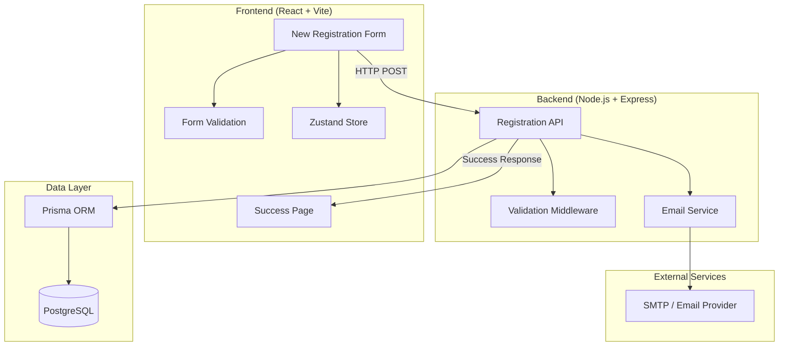
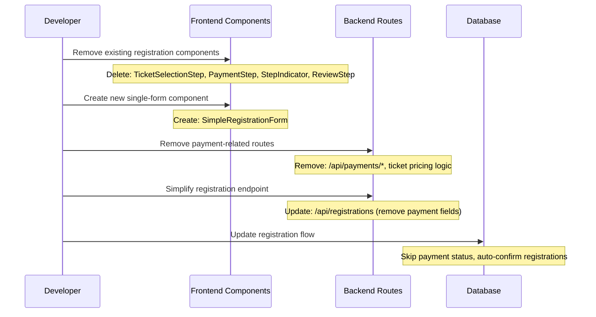
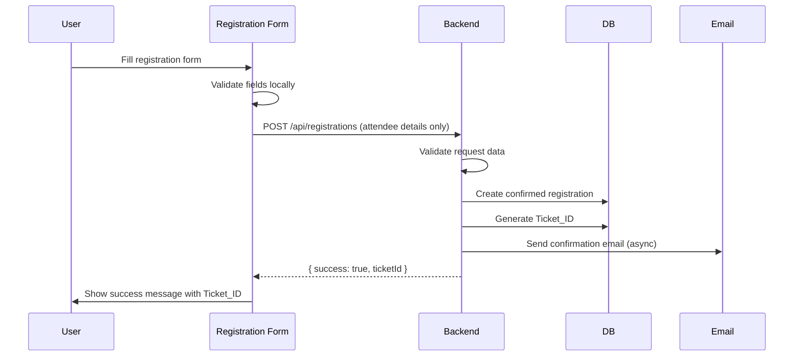

# Design Document: Registration Form Rebuild

## Overview

The Registration Form Rebuild feature involves completely removing the existing pricing and registration structure from the AllHealthTech event platform and building a new, streamlined registration form system from scratch. This redesign will eliminate the current multi-step registration flow, pricing tiers, and payment integration, replacing them with a simplified single-form registration system that focuses on collecting attendee information without payment processing.

The new system will maintain the existing database schema for attendee data but remove all payment-related functionality, ticket type selection, and pricing components. The goal is to create a clean, conversion-optimized registration experience that captures essential attendee information while removing the complexity of payment processing and ticket tier management.

## Architecture

### High-Level Architecture



### Component Removal and Replacement Flow



### New Registration Flow



## Components and Interfaces

### Frontend Component Structure (New)

```
RegistrationPage (Updated)
├── SimpleRegistrationForm (New)
│   ├── PersonalInfoSection
│   ├── ProfessionalInfoSection
│   └── SubmitButton
└── RegistrationSuccess (New)
    ├── ConfirmationMessage
    └── TicketDetails
```

### Components to Remove

```
// Remove these existing components:
- TicketSelectionStep.jsx
- PaymentStep.jsx
- ReviewStep.jsx
- StepIndicator.jsx
- PricingPage.jsx (entire page)

// Keep but modify:
- RegistrationPage.jsx (simplify)
- AttendeeDetailsStep.jsx (rename to SimpleRegistrationForm)
- SuccessStep.jsx (simplify)
```

### New Registration Form Interface

```typescript
interface SimpleRegistrationFormProps {
  onSubmit: (data: RegistrationData) => Promise<void>;
  loading?: boolean;
  error?: string;
}

interface RegistrationData {
  attendeeName: string;
  attendeeEmail: string;
  attendeePhone: string;
  organization?: string;
  role?: string;
  dietaryRestrictions?: string;
  accessibilityNeeds?: string;
}

interface RegistrationResponse {
  success: boolean;
  ticketId: string;
  message: string;
}
```

### Updated Zustand Store Structure

```typescript
interface RegistrationStore {
  // Simplified state - remove payment and step management
  registrationData: RegistrationData | null;
  setRegistrationData: (data: RegistrationData) => void;
  
  // Registration result
  confirmedTicketId: string | null;
  setConfirmedTicketId: (id: string) => void;
  
  // Form state
  isSubmitting: boolean;
  setSubmitting: (loading: boolean) => void;
  
  // Reset form
  reset: () => void;
}

// Remove these from store:
// - currentStep
// - selectedTicket
// - payment-related state
```

## Data Models

### Updated Registration Model (Database Changes)

```typescript
// Updated Registration creation (remove payment fields)
interface CreateRegistrationRequest {
  attendeeName: string;
  attendeeEmail: string;
  attendeePhone: string;
  organization?: string;
  role?: string;
  dietaryRestrictions?: string;
  accessibilityNeeds?: string;
}

// Simplified response (no payment data)
interface CreateRegistrationResponse {
  success: boolean;
  ticketId: string;
  registrationId: string;
  message: string;
}
```

### Database Schema Changes

```sql
-- Keep existing Registration table structure but modify usage:
-- Set these fields to default values for new registrations:
-- paymentStatus = 'PAID' (skip payment)
-- status = 'CONFIRMED' (auto-confirm)
-- ticketTypeId = default_ticket_type_id (single ticket type)

-- Add new optional fields:
ALTER TABLE Registration ADD COLUMN dietaryRestrictions TEXT;
ALTER TABLE Registration ADD COLUMN accessibilityNeeds TEXT;

-- Remove/deprecate payment-related tables and fields in application logic:
-- Keep schema for data integrity but don't use in new flow
```

## Algorithmic Pseudocode

### Main Registration Processing Algorithm

```javascript
ALGORITHM processRegistration(registrationData)
INPUT: registrationData of type RegistrationData
OUTPUT: result of type RegistrationResponse

BEGIN
  ASSERT validateRegistrationData(registrationData) = true
  
  // Step 1: Generate unique ticket ID
  ticketId ← generateTicketId()
  
  // Step 2: Get default event and ticket type
  event ← getCurrentEvent()
  defaultTicketType ← getDefaultTicketType(event.id)
  
  // Step 3: Create confirmed registration (skip payment)
  registration ← createRegistration({
    ticketId: ticketId,
    eventId: event.id,
    ticketTypeId: defaultTicketType.id,
    attendeeName: registrationData.attendeeName,
    attendeeEmail: registrationData.attendeeEmail,
    attendeePhone: registrationData.attendeePhone,
    organization: registrationData.organization,
    role: registrationData.role,
    dietaryRestrictions: registrationData.dietaryRestrictions,
    accessibilityNeeds: registrationData.accessibilityNeeds,
    status: 'CONFIRMED',
    paymentStatus: 'PAID'  // Auto-set as paid
  })
  
  // Step 4: Send confirmation email asynchronously
  sendConfirmationEmailAsync(registration)
  
  // Step 5: Return success response
  RETURN {
    success: true,
    ticketId: ticketId,
    registrationId: registration.id,
    message: "Registration confirmed successfully"
  }
END
```

**Preconditions:**
- registrationData is validated and well-formed
- attendeeEmail is unique for the event
- getCurrentEvent() returns active event
- getDefaultTicketType() returns valid ticket type

**Postconditions:**
- Registration record is created with CONFIRMED status
- Unique ticketId is generated and assigned
- Confirmation email is queued for sending
- Response contains valid ticketId

**Loop Invariants:** N/A (no loops in main algorithm)

### Form Validation Algorithm

```javascript
ALGORITHM validateRegistrationData(data)
INPUT: data of type RegistrationData
OUTPUT: isValid of type boolean, errors of type ValidationErrors

BEGIN
  errors ← {}
  
  // Validate required fields
  IF data.attendeeName = null OR trim(data.attendeeName) = "" THEN
    errors.attendeeName ← "Full name is required"
  END IF
  
  IF data.attendeeEmail = null OR NOT isValidEmail(data.attendeeEmail) THEN
    errors.attendeeEmail ← "Valid email address is required"
  END IF
  
  IF data.attendeePhone = null OR length(trim(data.attendeePhone)) < 7 THEN
    errors.attendeePhone ← "Valid phone number is required"
  END IF
  
  // Check for duplicate email registration
  IF emailAlreadyRegistered(data.attendeeEmail) THEN
    errors.attendeeEmail ← "This email is already registered for the event"
  END IF
  
  // Validate optional fields if provided
  IF data.organization ≠ null AND length(trim(data.organization)) > 100 THEN
    errors.organization ← "Organization name must be less than 100 characters"
  END IF
  
  IF data.role ≠ null AND length(trim(data.role)) > 100 THEN
    errors.role ← "Role must be less than 100 characters"
  END IF
  
  isValid ← (size(errors) = 0)
  RETURN isValid, errors
END
```

**Preconditions:**
- data parameter is provided (may contain null/undefined fields)
- isValidEmail function is available
- emailAlreadyRegistered function is available

**Postconditions:**
- Returns boolean indicating overall validity
- Returns errors object with field-specific error messages
- No side effects on input data

**Loop Invariants:** N/A (no loops in validation)

## Key Functions with Formal Specifications

### Function 1: createSimpleRegistration()

```javascript
async function createSimpleRegistration(registrationData) {
  // Implementation details in algorithm above
}
```

**Preconditions:**
- `registrationData` is non-null and contains required fields
- `registrationData.attendeeEmail` is valid email format
- `registrationData.attendeePhone` is valid phone format
- Database connection is available

**Postconditions:**
- Returns RegistrationResponse object
- If successful: registration record exists in database with CONFIRMED status
- If error: throws exception with descriptive message
- Confirmation email is queued for sending on success

**Loop Invariants:** N/A

### Function 2: removeExistingComponents()

```javascript
function removeExistingComponents() {
  // Remove payment and multi-step components
}
```

**Preconditions:**
- Existing component files are present in filesystem
- No active references to components being removed

**Postconditions:**
- Specified component files are deleted
- Import statements are updated
- No broken references remain in codebase

**Loop Invariants:**
- For each component removal: all references are updated before deletion

## Example Usage

### New Registration Form Component

```javascript
// SimpleRegistrationForm.jsx
import { useState } from 'react';
import { useRegistrationStore } from '../stores/registrationStore';
import { apiFetch } from '../lib/api';

export default function SimpleRegistrationForm() {
  const [formData, setFormData] = useState({
    attendeeName: '',
    attendeeEmail: '',
    attendeePhone: '',
    organization: '',
    role: '',
    dietaryRestrictions: '',
    accessibilityNeeds: ''
  });
  
  const [errors, setErrors] = useState({});
  const { setConfirmedTicketId, isSubmitting, setSubmitting } = useRegistrationStore();

  const handleSubmit = async (e) => {
    e.preventDefault();
    setSubmitting(true);
    
    try {
      const response = await apiFetch('/api/registrations', {
        method: 'POST',
        headers: { 'Content-Type': 'application/json' },
        body: JSON.stringify(formData)
      });
      
      setConfirmedTicketId(response.ticketId);
      // Navigate to success page
    } catch (error) {
      setErrors({ general: error.message });
    } finally {
      setSubmitting(false);
    }
  };

  return (
    <form onSubmit={handleSubmit} className="space-y-6">
      <div className="grid grid-cols-1 md:grid-cols-2 gap-6">
        {/* Form fields */}
      </div>
      
      <button 
        type="submit" 
        disabled={isSubmitting}
        className="w-full bg-blue-600 text-white py-3 rounded-lg"
      >
        {isSubmitting ? 'Registering...' : 'Register for Event'}
      </button>
    </form>
  );
}
```

### Updated Backend Registration Route

```javascript
// Updated /api/registrations route
router.post('/', async (req, res, next) => {
  try {
    const registrationData = req.body;
    
    // Validate input
    const validation = validateRegistrationData(registrationData);
    if (!validation.isValid) {
      return res.status(400).json({ errors: validation.errors });
    }
    
    // Get default event and ticket type
    const event = await getCurrentEvent();
    const defaultTicketType = await getDefaultTicketType(event.id);
    
    // Generate ticket ID
    const ticketId = await generateTicketId();
    
    // Create confirmed registration
    const registration = await prisma.registration.create({
      data: {
        ticketId,
        eventId: event.id,
        ticketTypeId: defaultTicketType.id,
        ...registrationData,
        status: 'CONFIRMED',
        paymentStatus: 'PAID'
      }
    });
    
    // Send confirmation email (async)
    sendConfirmationEmail(registration).catch(console.error);
    
    res.status(201).json({
      success: true,
      ticketId: registration.ticketId,
      registrationId: registration.id,
      message: 'Registration confirmed successfully'
    });
    
  } catch (error) {
    next(error);
  }
});
```

### Component Removal Script

```javascript
// Script to remove existing components
const componentsToRemove = [
  'frontend/src/components/registration/TicketSelectionStep.jsx',
  'frontend/src/components/registration/PaymentStep.jsx',
  'frontend/src/components/registration/ReviewStep.jsx',
  'frontend/src/components/registration/StepIndicator.jsx',
  'frontend/src/pages/PricingPage.jsx'
];

const routesToRemove = [
  'backend/src/routes/payments.js'
];

// Remove payment service functions
const functionsToRemove = [
  'createOrder',
  'verifySignature',
  'initiateRefund'
];
```

## Correctness Properties

### Universal Quantification Statements

1. **Registration Uniqueness**: ∀ email ∈ ValidEmails, ∃ at most one Registration r such that r.attendeeEmail = email ∧ r.eventId = currentEvent.id

2. **Ticket ID Uniqueness**: ∀ registrations r1, r2 ∈ Registrations, r1 ≠ r2 ⟹ r1.ticketId ≠ r2.ticketId

3. **Auto-Confirmation**: ∀ registration r ∈ NewRegistrations, r.status = 'CONFIRMED' ∧ r.paymentStatus = 'PAID'

4. **Required Field Validation**: ∀ registrationData d ∈ SubmittedData, (d.attendeeName ≠ null ∧ d.attendeeEmail ≠ null ∧ d.attendeePhone ≠ null) ∨ ValidationError

5. **Email Format Validation**: ∀ email ∈ SubmittedEmails, isValidEmail(email) = true ∨ ValidationError

## Error Handling

### Error Scenario 1: Duplicate Email Registration

**Condition**: User attempts to register with an email already used for the current event
**Response**: Return 409 Conflict with message "This email is already registered for the event"
**Recovery**: User can use different email or contact support to modify existing registration

### Error Scenario 2: Invalid Form Data

**Condition**: Required fields are missing or invalid format
**Response**: Return 400 Bad Request with field-specific error messages
**Recovery**: User corrects form fields and resubmits

### Error Scenario 3: Database Connection Failure

**Condition**: Database is unavailable during registration submission
**Response**: Return 503 Service Unavailable with retry message
**Recovery**: User can retry submission after brief delay

### Error Scenario 4: Email Service Failure

**Condition**: Confirmation email fails to send after successful registration
**Response**: Registration still succeeds, log email failure
**Recovery**: User receives ticket ID on screen, can use lookup feature if needed

## Testing Strategy

### Unit Testing Approach

- Test form validation logic with valid and invalid inputs
- Test registration creation with various data combinations
- Test error handling for database failures
- Test component rendering and user interactions
- Mock external dependencies (database, email service)

### Integration Testing Approach

- Test complete registration flow from form submission to database storage
- Test email confirmation sending
- Test registration lookup functionality
- Test error scenarios with real database connections

### Property-Based Testing Approach

**Property Test Library**: fast-check (JavaScript)

**Key Properties to Test**:
1. **Email Uniqueness**: For any valid email, only one registration should exist per event
2. **Ticket ID Generation**: All generated ticket IDs should be unique and follow format
3. **Form Validation**: Invalid inputs should always be rejected
4. **Data Persistence**: Successfully submitted registrations should always be retrievable

## Performance Considerations

- Single-form submission reduces server round trips from 4+ to 1
- Remove payment processing eliminates external API calls to Razorpay
- Simplified state management reduces frontend memory usage
- Auto-confirmation eliminates payment verification delays
- Form validation happens client-side for immediate feedback

## Security Considerations

- Input validation and sanitization for all form fields
- Rate limiting on registration endpoint to prevent spam
- Email verification to prevent fake registrations
- CSRF protection on form submissions
- SQL injection prevention through Prisma ORM

## Dependencies

### Dependencies to Remove
- Razorpay SDK and payment processing libraries
- Multi-step form state management complexity
- Payment verification and webhook handling

### Dependencies to Keep
- Prisma ORM for database operations
- Nodemailer for email confirmations
- Zod for request validation
- React Hook Form for form management
- Tailwind CSS for styling

### New Dependencies (Optional)
- React Hook Form (if not already present) for better form handling
- Yup or Joi for enhanced client-side validation