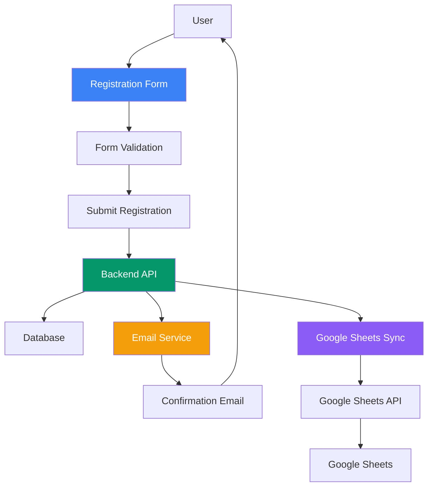
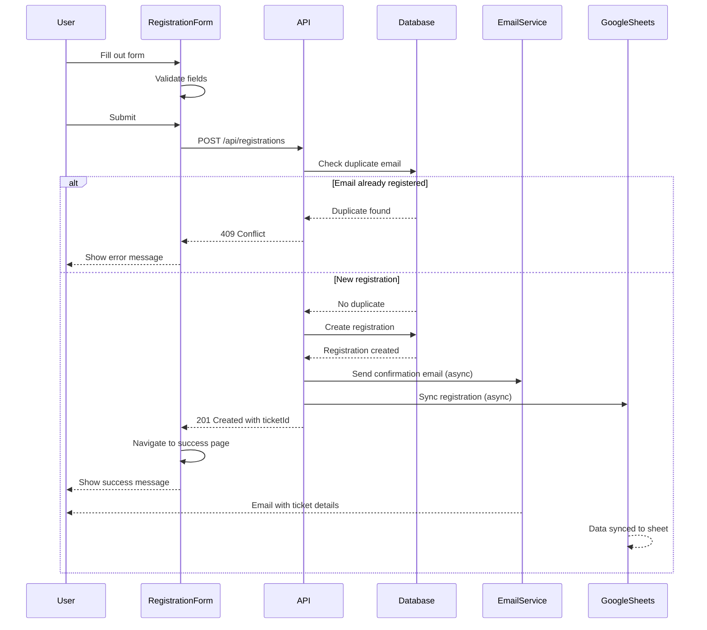
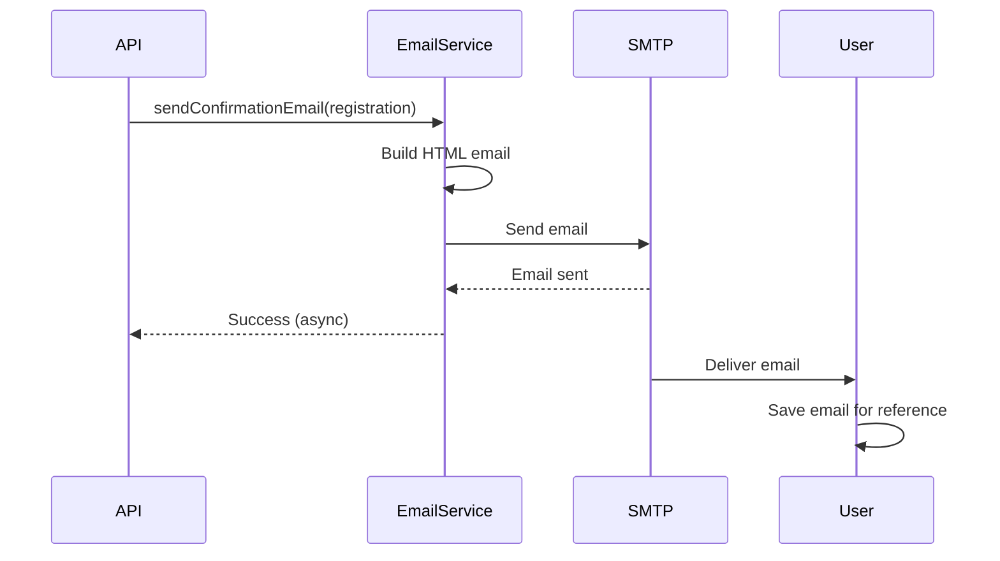
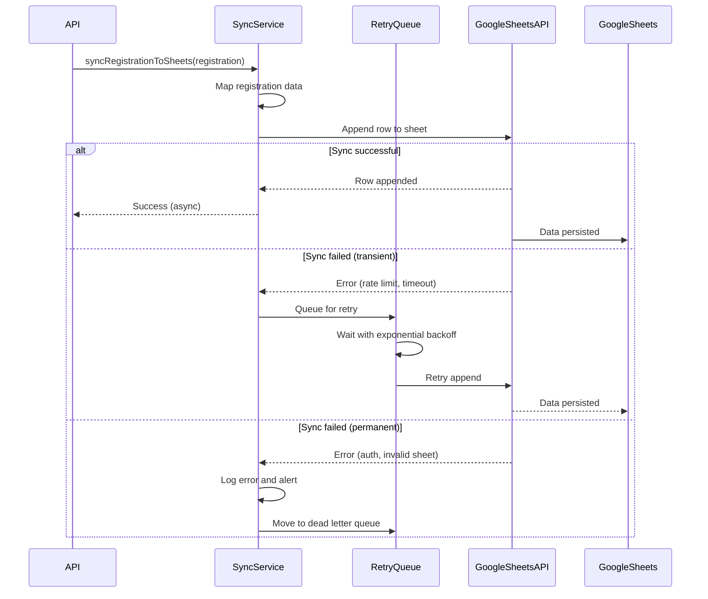

# Design Document: Simplified Registration Flow

## Overview

The simplified registration flow removes the "My Ticket" verification system to streamline the user experience. The new flow follows a direct path: Form → Payment → Email Confirmation. Users will no longer be able to look up their registration through the website; instead, they will receive all necessary information via email confirmation. This change reduces complexity in both the frontend and backend while maintaining essential functionality through email-based ticket management.

The key changes include removing the CheckRegistrationPage component and its associated route, removing the "My Ticket" navigation link, eliminating the `/api/registrations/lookup` and `/api/registrations/:id/cancel` endpoints, and ensuring the email confirmation system contains all necessary ticket information for users to reference.

## Architecture



## Sequence Diagrams

### Main Registration Flow



### Email Confirmation Flow



### Google Sheets Sync Flow



## Components and Interfaces

### Frontend Components

#### RegistrationPage Component

**Purpose**: Main page container for the registration flow

**Interface**:
```typescript
interface RegistrationPageProps {}

interface RegistrationPageState {
  isSuccess: boolean
}
```

**Responsibilities**:
- Render registration form or success step based on route
- Provide page layout and styling
- Handle route-based state management

#### SimpleRegistrationForm Component

**Purpose**: Single-page registration form with validation and submission

**Interface**:
```typescript
interface FormFields {
  attendeeName: string
  attendeeEmail: string
  attendeePhone: string
  organization?: string
  role?: string
  dietaryRestrictions?: string
  accessibilityNeeds?: string
}

interface ValidationErrors {
  [key: string]: string | undefined
}

interface SimpleRegistrationFormProps {}
```

**Responsibilities**:
- Collect user registration data
- Perform client-side validation
- Submit registration to backend API
- Handle success and error states
- Navigate to success page on completion

#### SuccessStep Component

**Purpose**: Display confirmation message after successful registration

**Interface**:
```typescript
interface SuccessStepProps {}
```

**Responsibilities**:
- Display success message
- Show ticket ID from store
- Provide instructions to check email
- Offer navigation back to home

#### Navbar Component (Modified)

**Purpose**: Site navigation without "My Ticket" link

**Interface**:
```typescript
interface NavLink {
  to: string
  label: string
}

interface NavbarProps {}
```

**Responsibilities**:
- Render navigation links (excluding "My Ticket")
- Handle mobile menu toggle
- Provide "Register Now" CTA

### Backend Components

#### Registration Routes (Modified)

**Purpose**: Handle registration creation without lookup/cancel endpoints

**Interface**:
```typescript
// POST /api/registrations
interface CreateRegistrationRequest {
  ticketTypeId?: string
  attendeeName: string
  attendeeEmail: string
  attendeePhone: string
  organization?: string
  role?: string
  dietaryRestrictions?: string
  accessibilityNeeds?: string
}

interface CreateRegistrationResponse {
  success: boolean
  registrationId: string
  ticketId: string
}
```

**Responsibilities**:
- Validate registration data
- Check for duplicate email registrations
- Create registration record
- Generate unique ticket ID
- Trigger confirmation email
- Trigger Google Sheets sync
- Return ticket ID to frontend

#### Email Service

**Purpose**: Send confirmation emails with complete ticket information

**Interface**:
```typescript
interface RegistrationEmailData {
  ticketId: string
  attendeeName: string
  attendeeEmail: string
  organization?: string
  role?: string
  dietaryRestrictions?: string
  accessibilityNeeds?: string
  ticketType: { name: string }
  event: { name: string; date: Date; location: string }
}

async function sendConfirmationEmail(
  registration: RegistrationEmailData
): Promise<void>
```

**Responsibilities**:
- Format registration data into HTML email
- Include all ticket details in email
- Send email via SMTP
- Handle email sending errors gracefully

#### Google Sheets Sync Service

**Purpose**: Synchronize registration data to Google Sheets in real-time

**Interface**:
```typescript
interface GoogleSheetsConfig {
  spreadsheetId: string
  sheetName: string
  credentialsPath: string
}

interface RegistrationSheetRow {
  ticketId: string
  attendeeName: string
  email: string
  phone: string
  organization?: string
  role?: string
  dietaryRestrictions?: string
  accessibilityNeeds?: string
  ticketType: string
  eventName: string
  registrationTimestamp: string
}

async function syncRegistrationToSheets(
  registration: Registration,
  config: GoogleSheetsConfig
): Promise<void>
```

**Responsibilities**:
- Authenticate with Google Sheets API
- Map registration data to sheet columns
- Append registration row to sheet
- Handle API errors and implement retry logic
- Log sync operations for monitoring
- Alert on persistent failures

#### Retry Manager Service

**Purpose**: Manage retry logic for failed Google Sheets syncs

**Interface**:
```typescript
interface RetryConfig {
  maxRetries: number
  initialDelayMs: number
  backoffMultiplier: number
}

interface FailedSync {
  registrationId: string
  error: string
  retryCount: number
  nextRetryTime: Date
}

async function retryFailedSync(
  failedSync: FailedSync,
  config: RetryConfig
): Promise<void>
```

**Responsibilities**:
- Queue failed syncs for retry
- Implement exponential backoff
- Distinguish transient vs. permanent errors
- Move permanently failed syncs to dead letter queue
- Log all retry attempts

## Data Models

### Registration Model (Unchanged)

```typescript
interface Registration {
  id: string
  ticketId: string
  eventId: string
  ticketTypeId: string
  attendeeName: string
  attendeeEmail: string
  attendeePhone: string
  organization?: string
  role?: string
  dietaryRestrictions?: string
  accessibilityNeeds?: string
  status: 'CONFIRMED' | 'PENDING' | 'CANCELLED'
  paymentStatus: 'PAID' | 'PENDING' | 'FAILED' | 'REFUNDED'
  createdAt: Date
  updatedAt: Date
  cancelledAt?: Date
}
```

**Validation Rules**:
- `attendeeName`: Required, 1-100 characters, trimmed
- `attendeeEmail`: Required, valid email format, max 255 characters, lowercase
- `attendeePhone`: Required, 7-20 characters, valid phone format
- `organization`: Optional, max 200 characters
- `role`: Optional, max 100 characters
- `dietaryRestrictions`: Optional, max 500 characters
- `accessibilityNeeds`: Optional, max 500 characters

### Email Configuration

```typescript
interface EmailConfig {
  host: string
  port: number
  secure: boolean
  auth: {
    user: string
    pass: string
  }
}

interface EmailTemplate {
  from: string
  to: string
  subject: string
  html: string
}
```

### Google Sheets Configuration

```typescript
interface GoogleSheetsConfig {
  spreadsheetId: string
  sheetName: string
  credentialsPath: string
  maxRetries: number
  initialDelayMs: number
  backoffMultiplier: number
}

interface GoogleSheetsColumnMapping {
  ticketId: 'Ticket ID'
  attendeeName: 'Attendee Name'
  email: 'Email'
  phone: 'Phone'
  organization: 'Organization'
  role: 'Role'
  dietaryRestrictions: 'Dietary Restrictions'
  accessibilityNeeds: 'Accessibility Needs'
  ticketType: 'Ticket Type'
  eventName: 'Event Name'
  registrationTimestamp: 'Registration Timestamp'
}

interface FailedSyncRecord {
  id: string
  registrationId: string
  registrationData: RegistrationSheetRow
  error: string
  retryCount: number
  nextRetryTime: Date
  createdAt: Date
  updatedAt: Date
}
```

## Algorithmic Pseudocode

### Main Registration Processing Algorithm

```javascript
async function processRegistration(formData) {
  // INPUT: formData of type FormFields
  // OUTPUT: result of type { success: boolean, ticketId?: string, error?: string }
  
  // PRECONDITION: formData is validated on client side
  // POSTCONDITION: Registration created in database OR error returned
  
  try {
    // Step 1: Validate input data
    const validatedData = validateRegistrationData(formData)
    
    // Step 2: Get current event
    const event = await database.getLatestEvent()
    if (!event) {
      return { success: false, error: 'No event found' }
    }
    
    // Step 3: Check for duplicate email
    const existingRegistration = await database.findRegistration({
      email: validatedData.attendeeEmail,
      eventId: event.id,
      status: 'not CANCELLED'
    })
    
    if (existingRegistration) {
      return { success: false, error: 'Email already registered' }
    }
    
    // Step 4: Get ticket type
    const ticketType = await getTicketType(validatedData.ticketTypeId, event.id)
    if (!ticketType) {
      return { success: false, error: 'Ticket type not found' }
    }
    
    // Step 5: Check capacity
    if (ticketType.capacity && ticketType.soldCount >= ticketType.capacity) {
      return { success: false, error: 'Ticket sold out' }
    }
    
    // Step 6: Create registration atomically
    const ticketId = generateTicketId()
    const registration = await database.transaction(async (tx) => {
      const reg = await tx.createRegistration({
        ticketId,
        eventId: event.id,
        ticketTypeId: ticketType.id,
        ...validatedData,
        status: 'CONFIRMED',
        paymentStatus: 'PAID'
      })
      
      await tx.updateTicketType(ticketType.id, {
        soldCount: ticketType.soldCount + 1
      })
      
      return reg
    })
    
    // Step 7: Send confirmation email (async, non-blocking)
    sendConfirmationEmail(registration).catch(error => {
      console.error('Email failed:', error)
    })
    
    // Step 8: Sync to Google Sheets (async, non-blocking)
    syncRegistrationToSheets(registration).catch(error => {
      console.error('Google Sheets sync failed:', error)
    })
    
    // Step 9: Return success
    return { success: true, ticketId: registration.ticketId }
    
  } catch (error) {
    return { success: false, error: error.message }
  }
}
```

**Preconditions:**
- `formData` contains all required fields
- Client-side validation has passed
- Database connection is available
- Email service is configured
- Google Sheets API is configured

**Postconditions:**
- Registration record created in database with status 'CONFIRMED'
- Ticket type sold count incremented
- Confirmation email sent (or queued)
- Google Sheets sync initiated (or queued)
- Unique ticket ID returned to client

**Loop Invariants:** N/A (no loops in main algorithm)

### Validation Algorithm

```javascript
function validateRegistrationData(formData) {
  // INPUT: formData of type FormFields
  // OUTPUT: validatedData of type FormFields OR throws ValidationError
  
  // PRECONDITION: formData is an object with string properties
  // POSTCONDITION: All fields are validated and sanitized
  
  const errors = {}
  
  // Validate required field: attendeeName
  if (!formData.attendeeName || !formData.attendeeName.trim()) {
    errors.attendeeName = 'Name is required'
  } else if (formData.attendeeName.trim().length > 100) {
    errors.attendeeName = 'Name must be less than 100 characters'
  }
  
  // Validate required field: attendeeEmail
  if (!formData.attendeeEmail || !formData.attendeeEmail.trim()) {
    errors.attendeeEmail = 'Email is required'
  } else if (!isValidEmail(formData.attendeeEmail.trim())) {
    errors.attendeeEmail = 'Invalid email format'
  } else if (formData.attendeeEmail.trim().length > 255) {
    errors.attendeeEmail = 'Email must be less than 255 characters'
  }
  
  // Validate required field: attendeePhone
  if (!formData.attendeePhone || !formData.attendeePhone.trim()) {
    errors.attendeePhone = 'Phone is required'
  } else if (formData.attendeePhone.trim().length < 7) {
    errors.attendeePhone = 'Phone must be at least 7 characters'
  } else if (formData.attendeePhone.trim().length > 20) {
    errors.attendeePhone = 'Phone must be less than 20 characters'
  }
  
  // Validate optional fields
  if (formData.organization && formData.organization.trim().length > 200) {
    errors.organization = 'Organization must be less than 200 characters'
  }
  
  if (formData.role && formData.role.trim().length > 100) {
    errors.role = 'Role must be less than 100 characters'
  }
  
  if (formData.dietaryRestrictions && formData.dietaryRestrictions.trim().length > 500) {
    errors.dietaryRestrictions = 'Dietary restrictions must be less than 500 characters'
  }
  
  if (formData.accessibilityNeeds && formData.accessibilityNeeds.trim().length > 500) {
    errors.accessibilityNeeds = 'Accessibility needs must be less than 500 characters'
  }
  
  // If any errors, throw validation error
  if (Object.keys(errors).length > 0) {
    throw new ValidationError(errors)
  }
  
  // Return sanitized data
  return {
    attendeeName: formData.attendeeName.trim(),
    attendeeEmail: formData.attendeeEmail.trim().toLowerCase(),
    attendeePhone: formData.attendeePhone.trim(),
    organization: formData.organization?.trim() || undefined,
    role: formData.role?.trim() || undefined,
    dietaryRestrictions: formData.dietaryRestrictions?.trim() || undefined,
    accessibilityNeeds: formData.accessibilityNeeds?.trim() || undefined
  }
}
```

**Preconditions:**
- `formData` is a non-null object
- All fields are strings or undefined

**Postconditions:**
- Returns sanitized data if all validations pass
- Throws ValidationError with error details if validation fails
- All returned strings are trimmed
- Email is lowercase

**Loop Invariants:** N/A (no loops)

### Email Sending Algorithm

```javascript
async function sendConfirmationEmail(registration) {
  // INPUT: registration of type RegistrationEmailData
  // OUTPUT: void (email sent) OR throws EmailError
  
  // PRECONDITION: registration contains all required fields
  // PRECONDITION: SMTP configuration is valid
  // POSTCONDITION: Email sent to registration.attendeeEmail
  
  // Step 1: Format event date
  const eventDate = formatDate(registration.event.date, 'en-IN', {
    weekday: 'long',
    year: 'numeric',
    month: 'long',
    day: 'numeric'
  })
  
  // Step 2: Build optional fields HTML
  let optionalFieldsHTML = ''
  
  if (registration.organization) {
    optionalFieldsHTML += buildTableRow('Organization', registration.organization)
  }
  
  if (registration.role) {
    optionalFieldsHTML += buildTableRow('Role', registration.role)
  }
  
  if (registration.dietaryRestrictions) {
    optionalFieldsHTML += buildTableRow('Dietary Restrictions', registration.dietaryRestrictions)
  }
  
  if (registration.accessibilityNeeds) {
    optionalFieldsHTML += buildTableRow('Accessibility Needs', registration.accessibilityNeeds)
  }
  
  // Step 3: Build complete email HTML
  const emailHTML = buildEmailTemplate({
    attendeeName: registration.attendeeName,
    ticketId: registration.ticketId,
    eventName: registration.event.name,
    eventDate: eventDate,
    eventLocation: registration.event.location,
    ticketType: registration.ticketType.name,
    optionalFields: optionalFieldsHTML
  })
  
  // Step 4: Send email via SMTP
  await smtpTransporter.sendMail({
    from: process.env.ORGANIZER_EMAIL,
    to: registration.attendeeEmail,
    subject: `Your AllHealthTech 2025 Ticket Confirmation - ${registration.ticketId}`,
    html: emailHTML
  })
  
  // POSTCONDITION: Email sent successfully
}
```

**Preconditions:**
- `registration` object is complete and valid
- SMTP transporter is configured
- `process.env.ORGANIZER_EMAIL` is set
- Network connection is available

**Postconditions:**
- Email sent to `registration.attendeeEmail`
- Email contains all ticket details
- Email includes ticket ID prominently
- Optional fields included only if present

**Loop Invariants:** N/A (no loops)

### Google Sheets Sync Algorithm

```javascript
async function syncRegistrationToSheets(registration, config) {
  // INPUT: registration of type Registration, config of type GoogleSheetsConfig
  // OUTPUT: void (sync successful) OR throws SyncError
  
  // PRECONDITION: registration contains all required fields
  // PRECONDITION: Google Sheets API is configured
  // PRECONDITION: Spreadsheet and sheet exist
  // POSTCONDITION: Registration data appended to Google Sheets
  
  try {
    // Step 1: Authenticate with Google Sheets API
    const auth = await getGoogleSheetsAuth(config.credentialsPath)
    const sheets = google.sheets({ version: 'v4', auth })
    
    // Step 2: Map registration data to sheet row
    const sheetRow = mapRegistrationToSheetRow(registration)
    
    // Step 3: Prepare values for append
    const values = [
      [
        sheetRow.ticketId,
        sheetRow.attendeeName,
        sheetRow.email,
        sheetRow.phone,
        sheetRow.organization || '',
        sheetRow.role || '',
        sheetRow.dietaryRestrictions || '',
        sheetRow.accessibilityNeeds || '',
        sheetRow.ticketType,
        sheetRow.eventName,
        sheetRow.registrationTimestamp
      ]
    ]
    
    // Step 4: Append row to sheet
    const response = await sheets.spreadsheets.values.append({
      spreadsheetId: config.spreadsheetId,
      range: `${config.sheetName}!A:K`,
      valueInputOption: 'USER_ENTERED',
      resource: { values }
    })
    
    // Step 5: Verify append was successful
    if (!response.data.updates || response.data.updates.updatedRows === 0) {
      throw new Error('Failed to append row to sheet')
    }
    
    // Step 6: Log successful sync
    logger.info('Registration synced to Google Sheets', {
      registrationId: registration.id,
      ticketId: registration.ticketId,
      updatedRows: response.data.updates.updatedRows
    })
    
    // POSTCONDITION: Registration data appended to sheet
    
  } catch (error) {
    // Handle different error types
    if (error.code === 'ENOTFOUND' || error.code === 'ETIMEDOUT') {
      // Transient error - should retry
      throw new TransientSyncError(error.message)
    } else if (error.status === 401 || error.status === 403) {
      // Authentication error - permanent
      throw new PermanentSyncError('Google Sheets authentication failed')
    } else if (error.status === 429) {
      // Rate limit - transient
      throw new TransientSyncError('Google Sheets rate limit exceeded')
    } else {
      // Unknown error
      throw new SyncError(error.message)
    }
  }
}
```

**Preconditions:**
- `registration` object is complete and valid
- Google Sheets API credentials are valid
- Spreadsheet exists and is accessible
- Sheet exists with proper headers
- Network connection is available

**Postconditions:**
- Registration data appended as new row in sheet
- Row contains all 11 columns in correct order
- Timestamp is in ISO 8601 format
- Optional fields are empty strings if not provided

**Loop Invariants:** N/A (no loops)

### Retry Manager Algorithm

```javascript
async function retryFailedSync(failedSync, config) {
  // INPUT: failedSync of type FailedSync, config of type RetryConfig
  // OUTPUT: void (retry successful) OR throws RetryError
  
  // PRECONDITION: failedSync contains registration data and error info
  // PRECONDITION: retryCount < maxRetries
  // POSTCONDITION: Sync retried OR moved to dead letter queue
  
  try {
    // Step 1: Calculate backoff delay
    const delayMs = config.initialDelayMs * Math.pow(config.backoffMultiplier, failedSync.retryCount)
    
    // Step 2: Wait for backoff period
    await sleep(delayMs)
    
    // Step 3: Attempt sync retry
    await syncRegistrationToSheets(failedSync.registrationData, config)
    
    // Step 4: Log successful retry
    logger.info('Failed sync retry succeeded', {
      registrationId: failedSync.registrationId,
      retryCount: failedSync.retryCount
    })
    
    // Step 5: Remove from retry queue
    await removeFromRetryQueue(failedSync.id)
    
    // POSTCONDITION: Sync successful, removed from queue
    
  } catch (error) {
    // Step 6: Determine if error is transient or permanent
    if (error instanceof TransientSyncError) {
      // Transient error - queue for another retry
      if (failedSync.retryCount < config.maxRetries) {
        failedSync.retryCount++
        failedSync.nextRetryTime = new Date(Date.now() + delayMs)
        await updateRetryQueue(failedSync)
        
        logger.info('Failed sync queued for retry', {
          registrationId: failedSync.registrationId,
          retryCount: failedSync.retryCount,
          nextRetryTime: failedSync.nextRetryTime
        })
      } else {
        // Max retries exceeded - move to dead letter queue
        await moveToDeadLetterQueue(failedSync, error)
        await alertSupport('Max retries exceeded for Google Sheets sync', failedSync)
      }
    } else {
      // Permanent error - move to dead letter queue immediately
      await moveToDeadLetterQueue(failedSync, error)
      await alertSupport('Permanent error in Google Sheets sync', failedSync)
    }
  }
}
```

**Preconditions:**
- `failedSync` contains valid registration data
- `retryCount` is less than `maxRetries`
- Google Sheets API is configured
- Retry queue is accessible

**Postconditions:**
- If transient error and retries remaining: moved back to retry queue with updated retry count
- If transient error and max retries exceeded: moved to dead letter queue and support alerted
- If permanent error: moved to dead letter queue and support alerted
- All retry attempts logged

**Loop Invariants:**
- During retry loop: retryCount increments by 1 each iteration
- During retry loop: delayMs increases exponentially

## Key Functions with Formal Specifications

### Function 1: handleSubmit()

```javascript
async function handleSubmit(event) {
  // Prevent default form submission
  // Validate form fields
  // Submit to API
  // Handle success/error
  // Navigate to success page
}
```

**Preconditions:**
- Form fields are populated
- User has clicked submit button
- API endpoint is available

**Postconditions:**
- If validation fails: error messages displayed, form not submitted
- If API call succeeds: user navigated to success page, ticket ID stored
- If API call fails: error message displayed, user can retry
- No side effects on input data

**Loop Invariants:** N/A

### Function 2: validateInput()

```javascript
function validate(fields) {
  // Check required fields
  // Validate email format
  // Validate phone format
  // Check field lengths
  // Return errors object
}
```

**Preconditions:**
- `fields` is a non-null object with string properties

**Postconditions:**
- Returns empty object if all validations pass
- Returns object with error messages if validation fails
- No mutations to input parameter

**Loop Invariants:** N/A

### Function 3: generateTicketId()

```javascript
async function generateTicketId(prisma) {
  // Generate unique ticket ID
  // Check for collisions
  // Return unique ID
}
```

**Preconditions:**
- Database connection is available
- Prisma client is initialized

**Postconditions:**
- Returns unique ticket ID in format "AHT-2025-XXXXX"
- Ticket ID does not exist in database
- Ticket ID is 5 digits, zero-padded

**Loop Invariants:**
- During collision check loop: all previously checked IDs were duplicates

## Example Usage

### Frontend: Submitting Registration Form

```javascript
// Example 1: User fills out form and submits
const formData = {
  attendeeName: 'Jane Doe',
  attendeeEmail: 'jane@example.com',
  attendeePhone: '+91 98765 43210',
  organization: 'Acme Corp',
  role: 'Product Manager',
  dietaryRestrictions: 'Vegetarian',
  accessibilityNeeds: ''
}

// Validate
const errors = validate(formData)
if (Object.keys(errors).length > 0) {
  setErrors(errors)
  return
}

// Submit
const response = await apiFetch('/api/registrations', {
  method: 'POST',
  headers: { 'Content-Type': 'application/json' },
  body: JSON.stringify(formData)
})

// Handle success
if (response.success && response.ticketId) {
  setConfirmedTicketId(response.ticketId)
  navigate('/registration/success')
}
```

### Backend: Processing Registration

```javascript
// Example 2: API endpoint handling registration
router.post('/', validate(createRegistrationSchema), async (req, res) => {
  const { attendeeName, attendeeEmail, attendeePhone, ...optionalFields } = req.body
  
  // Get current event
  const event = await prisma.event.findFirst({
    orderBy: { date: 'desc' }
  })
  
  // Check duplicate
  const existing = await prisma.registration.findFirst({
    where: { attendeeEmail, eventId: event.id, status: { not: 'CANCELLED' } }
  })
  
  if (existing) {
    return res.status(409).json({ error: 'Email already registered' })
  }
  
  // Create registration
  const ticketId = await generateTicketId(prisma)
  const registration = await prisma.registration.create({
    data: {
      ticketId,
      eventId: event.id,
      attendeeName,
      attendeeEmail,
      attendeePhone,
      ...optionalFields,
      status: 'CONFIRMED',
      paymentStatus: 'PAID'
    },
    include: { event: true, ticketType: true }
  })
  
  // Send email (async)
  sendConfirmationEmail(registration).catch(console.error)
  
  // Sync to Google Sheets (async)
  syncRegistrationToSheets(registration).catch(console.error)
  
  return res.status(201).json({
    success: true,
    ticketId: registration.ticketId
  })
})
```

### Email Service: Sending Confirmation

```javascript
// Example 3: Sending confirmation email
await sendConfirmationEmail({
  ticketId: 'AHT-2025-00123',
  attendeeName: 'Jane Doe',
  attendeeEmail: 'jane@example.com',
  organization: 'Acme Corp',
  role: 'Product Manager',
  dietaryRestrictions: 'Vegetarian',
  accessibilityNeeds: undefined,
  ticketType: { name: 'General Admission' },
  event: {
    name: 'AllHealthTech 2025',
    date: new Date('2025-10-15'),
    location: 'Bombay Exhibition Centre, Mumbai'
  }
})

// Email sent with all ticket details
// User receives email with ticket ID prominently displayed
// User can reference email for all registration information
```

### Google Sheets Sync: Syncing Registration

```javascript
// Example 4: Syncing registration to Google Sheets
const registration = {
  id: 'reg-123',
  ticketId: 'AHT-2025-00123',
  attendeeName: 'Jane Doe',
  attendeeEmail: 'jane@example.com',
  attendeePhone: '+91 98765 43210',
  organization: 'Acme Corp',
  role: 'Product Manager',
  dietaryRestrictions: 'Vegetarian',
  accessibilityNeeds: undefined,
  ticketType: { name: 'General Admission' },
  event: { name: 'AllHealthTech 2025' },
  createdAt: new Date('2025-10-01T14:30:00Z')
}

const config = {
  spreadsheetId: process.env.GOOGLE_SHEETS_ID,
  sheetName: 'Registrations',
  credentialsPath: process.env.GOOGLE_SHEETS_CREDENTIALS_PATH,
  maxRetries: 3,
  initialDelayMs: 1000,
  backoffMultiplier: 2
}

await syncRegistrationToSheets(registration, config)

// Result: New row appended to Google Sheets with:
// Ticket ID | Jane Doe | jane@example.com | +91 98765 43210 | Acme Corp | Product Manager | Vegetarian | | General Admission | AllHealthTech 2025 | 2025-10-01T14:30:00Z
```

### Retry Manager: Handling Failed Syncs

```javascript
// Example 5: Retrying failed Google Sheets sync
const failedSync = {
  id: 'sync-456',
  registrationId: 'reg-123',
  registrationData: { /* registration data */ },
  error: 'Rate limit exceeded',
  retryCount: 1,
  nextRetryTime: new Date(Date.now() + 2000),
  createdAt: new Date(),
  updatedAt: new Date()
}

const config = {
  maxRetries: 3,
  initialDelayMs: 1000,
  backoffMultiplier: 2
}

// First retry: waits 2 seconds (1000 * 2^1)
// Second retry: waits 4 seconds (1000 * 2^2)
// Third retry: waits 8 seconds (1000 * 2^3)
// If all retries fail: moved to dead letter queue and support alerted

await retryFailedSync(failedSync, config)
```

## Correctness Properties

### Universal Quantification Statements

1. **Unique Ticket IDs**: ∀ registrations r1, r2 ∈ Registrations: r1 ≠ r2 ⟹ r1.ticketId ≠ r2.ticketId
   - Every registration must have a unique ticket ID

2. **Email Uniqueness Per Event**: ∀ registrations r1, r2 ∈ Registrations: (r1.eventId = r2.eventId ∧ r1.status ≠ 'CANCELLED' ∧ r2.status ≠ 'CANCELLED') ⟹ r1.attendeeEmail ≠ r2.attendeeEmail
   - No duplicate email registrations for the same event (excluding cancelled)

3. **Required Fields**: ∀ registration r ∈ Registrations: r.attendeeName ≠ ∅ ∧ r.attendeeEmail ≠ ∅ ∧ r.attendeePhone ≠ ∅
   - All registrations must have name, email, and phone

4. **Email Format**: ∀ registration r ∈ Registrations: isValidEmail(r.attendeeEmail) = true
   - All registration emails must be valid email format

5. **Confirmation Email Sent**: ∀ registration r ∈ Registrations: r.status = 'CONFIRMED' ⟹ emailSent(r.attendeeEmail, r.ticketId)
   - Every confirmed registration triggers a confirmation email

6. **Ticket ID Format**: ∀ registration r ∈ Registrations: r.ticketId matches pattern "AHT-2025-\d{5}"
   - All ticket IDs follow the format AHT-2025-XXXXX

7. **Status Consistency**: ∀ registration r ∈ Registrations: r.status ∈ {'CONFIRMED', 'PENDING', 'CANCELLED'}
   - Registration status must be one of the valid values

8. **Payment Status Consistency**: ∀ registration r ∈ Registrations: r.paymentStatus ∈ {'PAID', 'PENDING', 'FAILED', 'REFUNDED'}
   - Payment status must be one of the valid values

9. **Google Sheets Sync**: ∀ registration r ∈ Registrations: r.status = 'CONFIRMED' ⟹ sheetRowExists(r.ticketId, r.eventName)
   - Every confirmed registration must be synced to Google Sheets

10. **Sheet Column Consistency**: ∀ rows in GoogleSheets: row has exactly 11 columns with correct headers
    - All rows in the sheet must have consistent column structure

11. **Timestamp Format**: ∀ registration r ∈ Registrations: r.createdAt is in ISO 8601 format when synced to sheets
    - All timestamps in Google Sheets must be in ISO 8601 format

12. **Sync Retry Invariant**: ∀ failedSync f ∈ FailedSyncs: f.retryCount ≤ maxRetries
    - Failed syncs must not exceed maximum retry count

13. **Backoff Calculation**: ∀ failedSync f ∈ FailedSyncs: delayMs(f.retryCount) = initialDelayMs × backoffMultiplier^retryCount
    - Retry delays must follow exponential backoff formula

## Error Handling

### Error Scenario 1: Duplicate Email Registration

**Condition**: User attempts to register with an email already registered for the event
**Response**: API returns 409 Conflict with error message "This email is already registered for the event"
**Recovery**: User can use a different email address or contact support

### Error Scenario 2: Network Failure During Submission

**Condition**: Network connection lost while submitting registration form
**Response**: Frontend displays error message "Unable to connect to the server. Please check your internet connection and try again."
**Recovery**: User can retry submission when connection is restored

### Error Scenario 3: Email Sending Failure

**Condition**: SMTP service fails to send confirmation email
**Response**: Registration is still created successfully; error logged on server
**Recovery**: User receives ticket ID on success page; can contact support if email not received

### Error Scenario 4: Invalid Form Data

**Condition**: User submits form with invalid data (e.g., invalid email format)
**Response**: Client-side validation displays field-specific error messages
**Recovery**: User corrects invalid fields and resubmits

### Error Scenario 5: Server Error During Registration

**Condition**: Database or server error occurs during registration creation
**Response**: API returns 500 error; frontend displays "Server error occurred. Please try again in a few minutes."
**Recovery**: User can retry after a brief wait; support team notified

### Error Scenario 6: Ticket Type Sold Out

**Condition**: Ticket type reaches capacity between form load and submission
**Response**: API returns 409 Conflict with error "Ticket type is sold out"
**Recovery**: User can select different ticket type or wait for capacity increase

### Error Scenario 7: Google Sheets API Authentication Failure

**Condition**: Google Sheets API credentials are invalid or expired
**Response**: Registration is created successfully; sync fails and is logged; support team alerted
**Recovery**: Support team updates credentials; failed syncs are retried manually or via retry queue

### Error Scenario 8: Google Sheets Rate Limit Exceeded

**Condition**: Too many requests to Google Sheets API within time window
**Response**: Sync fails with transient error; automatically queued for retry with exponential backoff
**Recovery**: Retry manager retries sync after delay; if all retries fail, moved to dead letter queue

### Error Scenario 9: Google Sheets Spreadsheet Not Found

**Condition**: Spreadsheet ID is invalid or spreadsheet has been deleted
**Response**: Sync fails with permanent error; support team alerted
**Recovery**: Support team verifies spreadsheet exists and updates configuration; failed syncs moved to dead letter queue

### Error Scenario 10: Google Sheets Sheet Not Found

**Condition**: Sheet name doesn't exist in the spreadsheet
**Response**: Sync fails; system attempts to create sheet with proper headers; if creation fails, support team alerted
**Recovery**: Support team verifies sheet exists or creates it manually; failed syncs retried

### Error Scenario 11: Google Sheets Sync Timeout

**Condition**: Google Sheets API request times out
**Response**: Sync fails with transient error; automatically queued for retry
**Recovery**: Retry manager retries sync with exponential backoff

## Testing Strategy

### Unit Testing Approach

**Frontend Unit Tests**:
- Test form validation logic with valid and invalid inputs
- Test error message display for each validation rule
- Test form submission with mocked API responses
- Test navigation to success page after successful submission
- Test error handling for network failures

**Backend Unit Tests**:
- Test registration creation with valid data
- Test duplicate email detection
- Test ticket ID generation uniqueness
- Test validation schema with edge cases
- Test error responses for various failure scenarios
- Test Google Sheets data mapping
- Test retry logic with various error types
- Test exponential backoff calculation

**Coverage Goals**: 80% code coverage for critical paths

### Property-Based Testing Approach

**Property Test Library**: fast-check (for JavaScript/TypeScript)

**Properties to Test**:

1. **Ticket ID Uniqueness**: Generate multiple registrations and verify all ticket IDs are unique
2. **Email Validation**: Generate random strings and verify email validation correctly identifies valid/invalid emails
3. **Field Length Constraints**: Generate strings of various lengths and verify validation enforces max length rules
4. **Idempotency**: Submitting the same registration data twice should result in duplicate error on second attempt
5. **Google Sheets Row Mapping**: Generate registrations with various field combinations and verify all fields map correctly to sheet columns
6. **Retry Backoff Calculation**: Verify exponential backoff formula produces correct delays for various retry counts
7. **Timestamp Format**: Generate registrations and verify timestamps are formatted as ISO 8601 when synced

**Example Property Test**:
```javascript
import fc from 'fast-check'

test('ticket IDs are always unique', async () => {
  await fc.assert(
    fc.asyncProperty(
      fc.array(fc.record({
        attendeeName: fc.string({ minLength: 1, maxLength: 100 }),
        attendeeEmail: fc.emailAddress(),
        attendeePhone: fc.string({ minLength: 7, maxLength: 20 })
      }), { minLength: 10, maxLength: 100 }),
      async (registrations) => {
        const ticketIds = await Promise.all(
          registrations.map(() => generateTicketId(prisma))
        )
        const uniqueIds = new Set(ticketIds)
        return uniqueIds.size === ticketIds.length
      }
    )
  )
})

test('Google Sheets row mapping preserves all data', async () => {
  await fc.assert(
    fc.asyncProperty(
      fc.record({
        ticketId: fc.string({ minLength: 1, maxLength: 50 }),
        attendeeName: fc.string({ minLength: 1, maxLength: 100 }),
        attendeeEmail: fc.emailAddress(),
        attendeePhone: fc.string({ minLength: 7, maxLength: 20 }),
        organization: fc.option(fc.string({ maxLength: 200 })),
        role: fc.option(fc.string({ maxLength: 100 })),
        dietaryRestrictions: fc.option(fc.string({ maxLength: 500 })),
        accessibilityNeeds: fc.option(fc.string({ maxLength: 500 })),
        ticketType: fc.string({ minLength: 1, maxLength: 100 }),
        eventName: fc.string({ minLength: 1, maxLength: 100 }),
        registrationTimestamp: fc.date()
      }),
      (registration) => {
        const row = mapRegistrationToSheetRow(registration)
        return (
          row.ticketId === registration.ticketId &&
          row.attendeeName === registration.attendeeName &&
          row.email === registration.attendeeEmail &&
          row.phone === registration.attendeePhone &&
          row.organization === (registration.organization || '') &&
          row.role === (registration.role || '') &&
          row.dietaryRestrictions === (registration.dietaryRestrictions || '') &&
          row.accessibilityNeeds === (registration.accessibilityNeeds || '') &&
          row.ticketType === registration.ticketType &&
          row.eventName === registration.eventName
        )
      }
    )
  )
})

test('exponential backoff calculation is correct', async () => {
  await fc.assert(
    fc.property(
      fc.integer({ min: 0, max: 10 }),
      fc.integer({ min: 100, max: 5000 }),
      fc.integer({ min: 1, max: 5 }),
      (retryCount, initialDelay, multiplier) => {
        const expectedDelay = initialDelay * Math.pow(multiplier, retryCount)
        const actualDelay = calculateBackoffDelay(retryCount, initialDelay, multiplier)
        return actualDelay === expectedDelay
      }
    )
  )
})
```

### Integration Testing Approach

**End-to-End Tests**:
- Test complete registration flow from form submission to success page
- Test email delivery using test SMTP server
- Test Google Sheets sync with test spreadsheet
- Test database transaction rollback on errors
- Test concurrent registration submissions with same email
- Test retry logic with simulated API failures

**Integration Points to Test**:
- Frontend → Backend API communication
- Backend → Database operations
- Backend → Email service integration
- Backend → Google Sheets API integration
- Retry queue → Google Sheets API
- Route navigation and state management

**Google Sheets Integration Tests**:
- Test sync with valid registration data
- Test sync with optional fields missing
- Test sync with special characters in data
- Test sync with rate limit errors (transient)
- Test sync with authentication errors (permanent)
- Test retry queue processing
- Test dead letter queue for permanent failures

## Performance Considerations

**Database Optimization**:
- Index on `attendeeEmail` and `eventId` for fast duplicate checking
- Index on `ticketId` for fast lookups (if needed in future)
- Use database transactions to ensure atomicity of registration creation

**Email Sending**:
- Send emails asynchronously to avoid blocking API response
- Implement retry logic for failed email sends
- Consider email queue for high-volume events

**Frontend Performance**:
- Lazy load registration page components
- Debounce form validation to reduce re-renders
- Optimize form field change handlers

**API Response Time**:
- Target: < 500ms for registration creation
- Monitor duplicate email check query performance
- Cache event data if needed

## Security Considerations

**Input Validation**:
- Sanitize all user inputs on both client and server
- Use Zod schema validation on backend
- Prevent XSS attacks through proper escaping
- Validate email format to prevent injection

**Data Protection**:
- Use HTTPS for all API communication
- Store email addresses securely
- Implement rate limiting on registration endpoint (already in place)
- Log security events for monitoring

**Email Security**:
- Use authenticated SMTP connection
- Validate email addresses before sending
- Include unsubscribe mechanism if required
- Protect against email injection attacks

**Privacy**:
- Only collect necessary user data
- Include privacy policy link in registration form
- Ensure GDPR compliance for email storage
- Provide clear data usage terms

## Dependencies

**Frontend Dependencies**:
- React 18.x
- React Router 6.x
- Zustand (state management)
- Tailwind CSS (styling)

**Backend Dependencies**:
- Express.js (web framework)
- Prisma (ORM)
- Zod (validation)
- Nodemailer (email sending)
- @google-cloud/sheets (Google Sheets API client)
- PostgreSQL (database)

**Development Dependencies**:
- Vite (frontend build tool)
- ESLint (linting)
- Prettier (code formatting)
- Vitest (testing framework)
- fast-check (property-based testing)

**External Services**:
- SMTP server for email delivery
- PostgreSQL database server
- Google Sheets API (for real-time sync)
- Google Cloud service account (for authentication)

**Environment Variables Required**:
- `SMTP_HOST`: SMTP server hostname
- `SMTP_PORT`: SMTP server port
- `SMTP_USER`: SMTP authentication username
- `SMTP_PASS`: SMTP authentication password
- `ORGANIZER_EMAIL`: Sender email address for confirmations
- `GOOGLE_SHEETS_ID`: Google Sheets spreadsheet ID
- `GOOGLE_SHEETS_SHEET_NAME`: Sheet name for registrations (default: "Registrations")
- `GOOGLE_SHEETS_CREDENTIALS_PATH`: Path to Google service account credentials JSON file
- `GOOGLE_SHEETS_MAX_RETRIES`: Maximum retry attempts for failed syncs (default: 3)
- `GOOGLE_SHEETS_INITIAL_DELAY_MS`: Initial retry delay in milliseconds (default: 1000)
- `GOOGLE_SHEETS_BACKOFF_MULTIPLIER`: Exponential backoff multiplier (default: 2)
